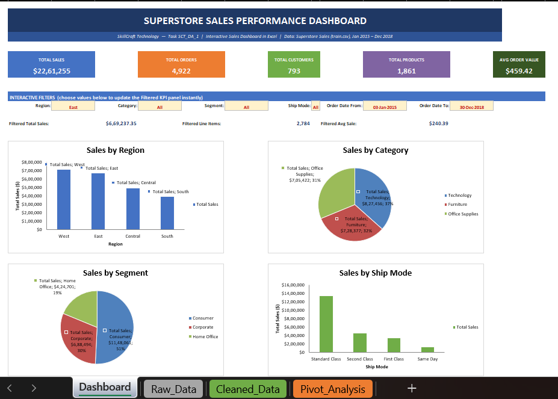

# Sales Performance Dashboard

## About the Project

This project is an Excel-based sales dashboard created to analyze sales performance and present the results through charts and interactive filters.

The workbook contains the raw data, cleaned data, pivot analysis, and the final dashboard.

## Tools Used

- Microsoft Excel
- Pivot Tables
- Pivot Charts
- Slicers
- Data Cleaning

## Workbook Sheets

- **Dashboard** – Final interactive dashboard
- **Raw_Data** – Original sales data
- **Cleaned_Data** – Data after cleaning and preparation
- **Pivot_Analysis** – Pivot tables used for analysis

## Dashboard Preview

## What I Analyzed

- Sales performance
- Sales by region
- Sales by category
- Sales by segment
- Shipping mode
- Overall sales trends

## Project Files

- `sales_performance.xlsx` – Complete Excel workbook
- `Dashboard.png` – Dashboard preview
